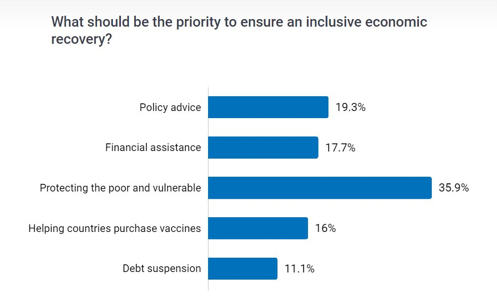

# Economic Recovery: Toward a Green, Resilient, and Inclusive Future

As countries rebuild their economies after **COVID-19**, it is fundamental that they see this as a unique opportunity to lay the foundation for a green, resilient, and inclusive future. These efforts were the theme of the event kicking off the Spring Meetings on Tuesday, __*Economic Recovery: Toward a Green, Resilient, and Inclusive Future.*__

> ###### Grammy-nominated singer Somi ended the event with a song, “Changing Inspiration.”

### Links 

Check out [Story: A Subdued Recovery, with Damage to Undo](https://www.worldbank.org/en/news/feature/2021/01/05/global-economic-prospects)

[Expert Answers: Will the Global Economy Recover in 2021?](https://www.youtube.com/watch?v=262VIilCVEU&feature=youtu.be)

[Blog: COVID-19 Response: Where We Stand Now, and the Road Ahead](https://blogs.worldbank.org/voices/covid-19-response-where-we-stand-now-and-road-ahead)

[How the World Bank Group is helping countries with COVID-19 (coronavirus)](https://www.worldbank.org/en/news/factsheet/2020/02/11/how-the-world-bank-group-is-helping-countries-with-covid-19-coronavirus)

